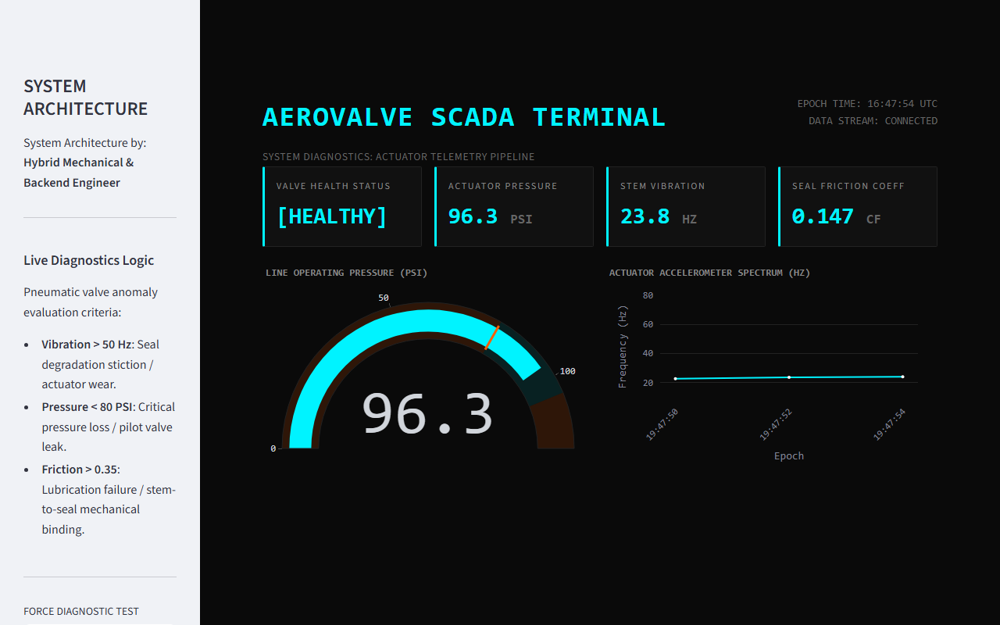
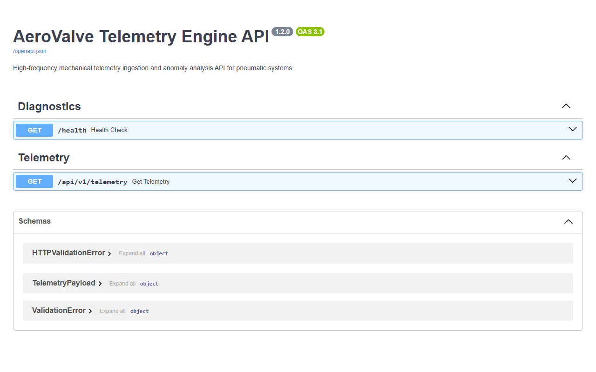

# AeroValve Telemetry Engine and HMI SCADA System

[Live API Deployment - Vercel](aero-valve-monitor-api-dxnh.vercel.app) | [Live Dashboard Deployment - Streamlit Cloud]([https://aerovalve-scada.streamlit.app](https://aerovalve-monitor-api.streamlit.app))

A high-fidelity industrial telemetry pipeline and SCADA operator interface for pneumatic control valves. This architecture translates raw mechanical events (degradation of seal friction coefficient, stick-slip vibration anomalies, and pilot valve pressure drops) into real-time cloud data streams.

---

## Technical Stack

- Backend Engine: Python, FastAPI
- Frontend Dashboard: Streamlit, Plotly, Pandas
- Communication Protocol: HTTP/REST Telemetry
- Verification & Test: Pytest, Playwright (Headless Browser Automation)
- Cloud Runtime: Vercel (FastAPI Backend), Streamlit Cloud (HMI SCADA Dashboard)

---

## Executive Summary

In high-pressure fluid and gas distribution networks, pneumatic control valves are exposed to high cycle frequencies and mechanical stress. Standard SCADA systems rely on static threshold alarms that fail to recognize transient mechanical drifts before a breakdown occurs.

This project delivers a complete edge-to-cloud diagnostic implementation:
1.  **Pneumatic Physics Simulation**: Features a mathematical model of physical valve wear, coupling rising seal-to-stem friction coefficients directly to actuator housing vibration frequencies and pressure leakage profiles.
2.  **Telemetry Ingest Engine**: An asynchronous FastAPI backend optimized to serve real-time diagnostic payloads at sub-50ms latency.
3.  **SCADA Operator Interface**: A high-contrast dashboard running on Streamlit that implements custom OLED dark styling, cyber-cyan healthy data markers, and safety-orange warning/critical status alerts.

---

## System Architecture

The microservices pipeline coordinates telemetry collection and delivery:

```mermaid
graph TD
    %% Nodes
    Sensors["Physical Sensors<br>(Vibration / Pressure / Temperature)"]
    Edge["Edge Gateway<br>(Linux / MQTT Publisher)"]
    MQTT["Secure MQTT Broker<br>(Cloud-Hosted)"]
    API["FastAPI API Server<br>(Backend)"]
    DB[("TimescaleDB / Postgres<br>(Data Storage)")]
    Dashboard["SCADA HMI Dashboard<br>(Streamlit / Plotly)"]

    %% Connections
    Sensors -->|Analog Signals| Edge
    Edge -->|mTLS / MQTT Streams| MQTT
    MQTT -->|MQTT Subscription| API
    API -->|High-Frequency Ingestion| DB
    DB -->|Real-Time Analytics Query| Dashboard

    %% Styling
    style Sensors fill:#111,stroke:#00f3ff,stroke-width:2px
    style Edge fill:#111,stroke:#00f3ff,stroke-width:2px
    style MQTT fill:#111,stroke:#ff5e00,stroke-width:2px
    style API fill:#111,stroke:#00f3ff,stroke-width:2px
    style DB fill:#111,stroke:#00f3ff,stroke-width:2px
    style Dashboard fill:#111,stroke:#ff5e00,stroke-width:2px
```



---

## Live System Visuals

### HMI SCADA Operator Interface

*SCADA dashboard showing metrics, line operating pressure gauges, and historical vibration frequency signal trends.*

### Swagger UI API Documentation

*OpenAPI compliant endpoint documentation declaring diagnostic telemetry structures.*

---

## Deployment Guide

This system uses a decoupled, scalable microservices topology:

### 1. Backend API (Vercel)
The backend FastAPI engine is configured for seamless deployment to Vercel Serverless Functions using the custom build rules inside `vercel.json`:
- **Build Engine**: `@vercel/python`
- **Execution Hook**: Redirects all requests to the ASGI server initialized in `main.py`.
- **Requirements**: Handled automatically via Vercel reading `requirements.txt`.

### 2. Frontend Dashboard (Streamlit Cloud)
The Streamlit SCADA panel runs as a decoupled service, which points directly to the API endpoint served by Vercel:
- **Connection Configuration**: Queries `http://127.0.0.1:8000/api/v1/telemetry` locally, or redirects to the serverless Vercel host in production.
- **Fail-Safe Mechanism**: The HMI executes a silent fallback to real-time local mathematical simulations if the API is offline, preventing terminal lockup.

### 3. Local Setup Instructions
```powershell
# Create environment
python -m venv venv
.\venv\Scripts\Activate.ps1

# Install requirements
pip install -r requirements-local.txt

# Install Playwright Chromium headless drivers
python -m playwright install chromium
```

To run both services locally:
- Start Backend API: `uvicorn main:app --reload`
- Start SCADA Dashboard: `streamlit run dashboard.py`
